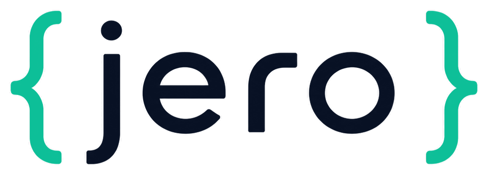

<div align="center">



<p>
  <a href="https://pypi.org/project/jero/"></a>
  <a href="https://github.com/RogerThomas/jero/actions/workflows/main.yml?query=branch%3Amain"></a>
  <a href="https://codecov.io/gh/RogerThomas/jero"></a>
  <a href="https://pypi.org/project/jero/"></a>
  <a href="https://github.com/RogerThomas/jero/blob/main/LICENSE"></a>
</p>

**An opinionated, msgspec-first ASGI micro-framework for Python 3.13+.**

<br>
<em>Engineered for performance from the ground up</em>
<br>
<em>Strictly typed end to end</em>
<br>
<em>A joy to build on</em>
<br>
<a href="https://github.com/RogerThomas/jero/">GitHub</a> · <a href="https://RogerThomas.github.io/jero/">Documentation</a>

</div>

**jero** builds typed JSON/REST APIs from plain classes. Annotate your handlers with
[msgspec](https://msgspec.dev/) Structs — jero does the rest: routing,
validation, serialization, auth, streaming, and resource lifecycle.

```python
from msgspec import Struct

from jero import BaseApp, Resource


class Widget(Struct):
    id: str
    name: str


class WidgetPath(Struct):
    widget_id: str


class Widgets(Resource, path="/widgets"):
    async def read_one(self, path: WidgetPath) -> Widget:  # GET /widgets/{widget_id}
        return Widget(id=path.widget_id, name="gizmo")


class App(BaseApp):
    async def wire(self) -> None:
        self.include_resource(Widgets())


app = App()
```

```bash
granian --interface asgi myapp:app    # or uvicorn, or any ASGI server
```

No decorators, no `dict` returns, no runtime surprises — the `Struct` types *are* the
request/response contract, and they're verified at startup.

## Why jero?

<table>
<tr>
<td>⚡&nbsp;<strong>Fast</strong></td>
<td>The fastest Python ASGI framework across every workload in our <a href="#performance">benchmark</a>. All introspection happens once, at startup; the request path is just dict lookup → decode → call → encode.</td>
</tr>
<tr>
<td>🎯&nbsp;<strong>Opinionated</strong></td>
<td>One blessed way to do each thing, so you can't get it wrong. Contracts fail loud at startup with a precise <code>WiringError</code>, never quietly at runtime.</td>
</tr>
<tr>
<td>🔒&nbsp;<strong>Typed</strong></td>
<td>Fully static under pyright-strict, leaning hard into modern Python typing — PEP 695 generics (<code>JSONResponse[Body, Headers]</code>, <code>BaseApp[Factory]</code>), bounded type-params, generic inheritance, <code>Protocol</code>s. A handler's signature <em>is</em> its schema, and the source of the coming OpenAPI spec.</td>
</tr>
</table>

No DI container, either: dependencies are hand-wired in `wire`; the framework adds
only lifecycle — the one thing plain Python doesn't give you.

## What you get

- **Resources & Endpoints** — REST CRUD by method name, or bare verbs for one-off routes.
- **Bind by name, validated by msgspec** — `json`, `params`, `path`, `headers`, `form`,
  `user`; malformed → 400, schema-invalid → 422, all resolved once at startup.
- **Typed responses *and* typed headers** — `JSONResponse[Body, Headers]` keeps both
  schemas (no erasure), `status_code` overrides the status, and `raw_headers` is the
  escape hatch for cookies and the exotic tail.
- **Streaming, typed end to end** — NDJSON, Server-Sent Events, and raw byte streams,
  with lifecycle teardown and client-disconnect handling done for you.
- **Multipart forms & uploads** — typed parts, file uploads, per-part headers.
- **Auth checked at startup** — the `user` type is verified against your authenticator
  before a single request is served, not at runtime.
- **Lifecycle without a DI container** — hand-wire in `wire`, open resources on exit
  stacks, group construction in a `BaseFactory`.
- **REST semantics for free** — 404/400/422/401/405, auto `HEAD` + `OPTIONS`, camelCase
  on the wire.
- **A real test story** — a sync, in-process `TestClient` (no socket), streaming support,
  and a `factory=` seam for mocking.

Start with **[Getting Started](https://RogerThomas.github.io/jero/getting-started/)**, or
browse the full [Guide](https://RogerThomas.github.io/jero/).

## A real app

For anything real, a resource delegates to a service, and a `Factory` builds that
service — opening any resources it needs (HTTP clients, DB pools, …) on the app's
exit stacks, which jero closes in reverse at shutdown. The app is parameterised with
the factory type (`BaseApp[Factory]`), exposing it as `self.factory` in `wire`.

```python
from dataclasses import dataclass

import niquests
from msgspec import Struct
from msgspec.json import decode as json_decode
from msgspec.json import encode as json_encode

from jero import BaseApp, BaseFactory, HTTPError, Resource


class WidgetPath(Struct):
    widget_id: str


class WidgetIn(Struct):
    name: str


class Widget(WidgetIn):
    id: str


@dataclass
class WidgetService:
    """Owns the upstream HTTP client; built once by the factory."""

    _client: niquests.AsyncSession

    async def fetch(self, widget_id: str) -> Widget:
        resp = await self._client.get(f"/widgets/{widget_id}")
        if resp.status_code == 404:
            raise HTTPError(404, "widget not found")
        return json_decode(resp.content, type=Widget)

    async def create(self, data: WidgetIn) -> Widget:
        resp = await self._client.post("/widgets", data=json_encode(data))
        return json_decode(resp.content, type=Widget)


@dataclass
class WidgetResource(Resource, path="/widgets"):
    _service: WidgetService

    # called as: POST /widgets
    async def create(self, json: WidgetIn) -> Widget:
        return await self._service.create(json)

    # called as: GET /widgets/{widget_id}
    async def read_one(self, path: WidgetPath) -> Widget:
        return await self._service.fetch(path.widget_id)


class Factory(BaseFactory):
    async def create_widget_service(self) -> WidgetService:
        client = await self.aenter(niquests.AsyncSession(base_url="https://api.example.com"))
        return WidgetService(client)


class App(BaseApp[Factory]):
    async def wire(self) -> None:
        widget_service = await self.factory.create_widget_service()
        self.include_resource(WidgetResource(widget_service))


app = App()
```

## Performance

In a side-by-side benchmark against seven other frameworks — Python (Litestar, FastAPI,
Blacksheep, Robyn, Flask), Go (Gin), and Bun (Elysia) — **jero is the fastest Python
framework in every scenario tested.** On the pure framework hot path (a typed JSON
`GET`) it tops the table outright, ahead of both the Go and the Bun service:

| Framework      | `GET /info` req/s | Relative to jero |
| :------------- | :---------------- | :--------------- |
| **jero**       | **43.4k**         | **1.00×**        |
| blacksheep     | 39.7k             | 0.91×            |
| gin *(Go)*     | 39.2k             | 0.90×            |
| elysia *(Bun)* | 38.6k             | 0.89×            |
| litestar       | 33.8k             | 0.78×            |
| fastapi        | 25.7k             | 0.59×            |

On I/O-bound paths — proxying an upstream, reading from a database — Go pulls well clear,
because there the bottleneck is the HTTP-client and database-driver ecosystem, not the
framework. jero stays the fastest Python option, but it isn't as fast as Go in general,
and we're not claiming it is.

These are favourable, constrained conditions — single worker, single core, localhost,
best-of-N — and a microbenchmark is not your application. See the full methodology and
all four scenarios in the **[Performance docs](https://RogerThomas.github.io/jero/performance/)**.

## Development

```bash
task install   # create the venv and install pre-commit hooks
task check     # lock check + ruff, pyright, deptry, pylint (via prek)
task test      # run the test suite with coverage
```

See [`AGENTS.md`](AGENTS.md) for the design philosophy and the contract, and
[`style-guide.md`](style-guide.md) for project conventions.
