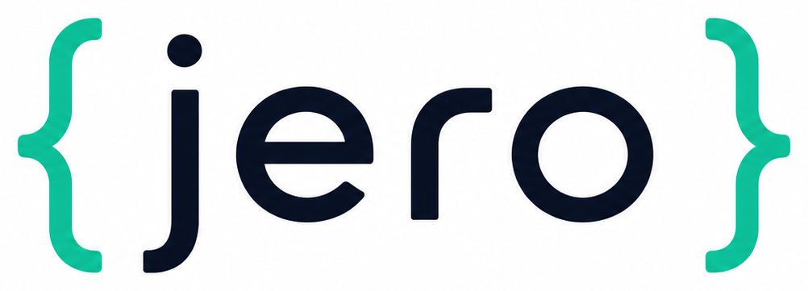

<div align="center">



<p>
  <a href="https://github.com/RogerThomas/jero/releases"></a>
  <a href="https://github.com/RogerThomas/jero/actions/workflows/main.yml?query=branch%3Amain"></a>
  <a href="https://codecov.io/gh/RogerThomas/jero"></a>
  <a href="https://github.com/RogerThomas/jero/commits/main"></a>
  <a href="https://github.com/RogerThomas/jero/blob/main/LICENSE"></a>
</p>

**An opinionated, msgspec-first ASGI micro-framework for Python 3.14.**

<a href="https://github.com/RogerThomas/jero/">GitHub</a> · <a href="https://RogerThomas.github.io/jero/">Documentation</a>

</div>

## What is jero?

jero is opinionated on purpose. It makes one bet: that being aggressively
prescriptive — rather than flexible — is exactly what lets a framework be *both*
extremely fast *and* a joy to build on. Three pillars, all non-negotiable:

1. **Speed.** Introspection happens once, at startup. The request path is dict
   lookup → msgspec decode → call → encode, and nothing else is ever added to it.
2. **Opinionated DX.** One blessed way to do each thing, encoded so you can't get it
   wrong. Contracts fail loud at startup with a precise `WiringError`, never quietly
   at runtime.
3. **Strict typing.** Fully static under pyright-strict — the types *are* the
   contract, and the source of the coming OpenAPI spec. If you don't like typing,
   this isn't your framework.

And no DI container: dependencies are hand-wired in `_wire`; the framework adds only
lifecycle — the one thing plain Python doesn't give you.

## Example

```python
from msgspec import Struct

from jero import BaseApp, Endpoint, Resource, TestClient


class Widget(Struct):
    id: str
    name: str


class WidgetResource(Resource):
    async def read_one(self, path: "WidgetPath") -> Widget:
        return Widget(id=path.widget_id, name="widget-name")


class WidgetPath(Struct):
    widget_id: str


class HealthEndpoint(Endpoint):
    async def get(self) -> Widget:
        return Widget(id="health", name="ok")


class App(BaseApp):
    async def _wire(self) -> None:
        self._include_resource(WidgetResource(), path="/widgets")
        self._include_endpoint(HealthEndpoint(), path="/healthz")


app = App()

# Test it in-process — no socket, no server:
with TestClient(app) as client:
    resp = client.get("/widgets/abc")
    assert resp.status_code == 200
    assert resp.json() == {"id": "abc", "name": "widget-name"}
```

Run it under any ASGI server, e.g. [granian](https://github.com/emmett-framework/granian):

```bash
granian --interface asgi myapp:app
```

## Development

```bash
task install   # create the venv and install pre-commit hooks
task check     # lock check + ruff, pyright, deptry, pylint (via prek)
task test      # run the test suite with coverage
```

See [`AGENTS.md`](AGENTS.md) for the design philosophy and the contract, and
[`style-guide.md`](style-guide.md) for project conventions.

## Releasing a new version

Publishing uses PyPI [Trusted Publishing](https://docs.pypi.org/trusted-publishers/)
(OIDC) — no token required.

1. Bump `version` in `pyproject.toml` and commit it to `main`.
2. Create a [GitHub release](https://github.com/RogerThomas/jero/releases/new)
   tagged with the **same** version — a bare PEP 440 string, e.g. `0.1.0` (no `v`).

The release workflow verifies the tag matches `pyproject.toml`, builds, publishes
to PyPI, and deploys the docs. A version mismatch fails the release.

---

Repository initiated with [osprey-oss/cookiecutter-uv](https://github.com/osprey-oss/cookiecutter-uv).
