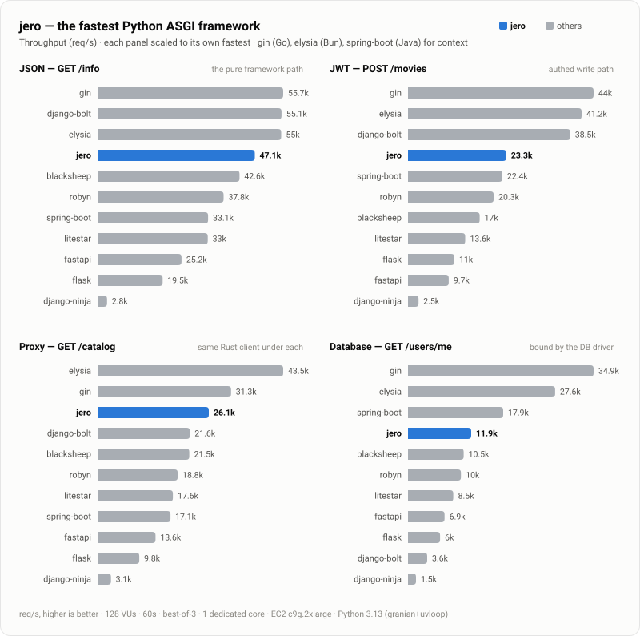

# Performance / Benchmarks

jero is built for speed, but the only honest way to talk about speed is with numbers
and a clear account of how they were produced. This page is that account, and the
entire benchmark (every app's source, the harness, and the full methodology) is public
at [api-benchmarks](https://github.com/RogerThomas/api-benchmarks).

**TL;DR:** across four workloads benchmarked side by side against ten other frameworks
(Python: Django Bolt, Blacksheep, Robyn, Litestar, FastAPI, Flask, Django Ninja; Go:
Gin; Bun: Elysia; Java: Spring Boot), **jero is the fastest Python ASGI framework in
every scenario**, and the fastest Python framework outright on the proxy and database
paths. On the pure framework path the top four (Elysia, Gin, Django Bolt, jero) finish
within 3% of each other: jero runs at Go speed there. Django Bolt, whose built-in Rust
server handles routing and serialization outside Python, edges that test by ~1% and
takes the authed write outright; jero leads it everywhere the request goes past the
framework. Go and Bun top the raw table; Spring Boot lands mid-field at five to ten
times everyone's resident memory (a JVM-defaults figure; see the caveats).

!!! warning "Read the caveats"

    These are favourable, constrained conditions, and a microbenchmark is not your
    application.

## At a glance

The whole field on all four workloads. Each panel is scaled to its own fastest
framework, so the bars show the ranking within that test; the labels keep the absolute
throughput. **jero is the fastest Python ASGI framework in every one.** Django Bolt
and Robyn ship their own Rust servers, and gin (Go), elysia (Bun), and spring-boot
(Java) are shown for cross-language context.

<p align="center">
  
</p>

## How the numbers were produced

The full account (every framework's app code, the compose files, the k6 scenarios, and
the methodology) lives in the
[api-benchmarks](https://github.com/RogerThomas/api-benchmarks) repo, and every run
writes a complete report (including per-container CPU and memory accounting) to its
`reports/` directory. The suite is written by jero's author; the code is public
precisely so you don't have to take fairness on trust. If a framework looks
shortchanged, open an issue there. The load-bearing points:

- **One framework alive at a time.** Each framework runs in its own compose stack
  alongside freshly started dependencies (Postgres, the Rust upstream, the k6 runner),
  torn down before the next framework starts. Nothing else competes for the machine, so
  each number reflects that framework alone.
- **Best-of-3.** [k6](https://k6.io/) drives a fixed virtual-user count for a fixed
  duration; every `(framework, scenario)` pair runs three times and the attempt with
  the highest throughput is kept. Repeating and keeping the best beats down run-to-run
  noise so the comparison reflects each framework's ceiling, not a noisy sample.
- **One worker, one core.** Every service runs one worker (Gin at `GOMAXPROCS=1`,
  Django Bolt at `--processes 1`), pinned to a single dedicated CPU core via `cpuset`
  affinity rather than a CFS quota, because a quota throttles a saturated container
  every scheduler period and pollutes the tail. The pin confines *all* of a framework's
  threads, including GIL-releasing extensions like msgspec and the DB drivers. This is
  a like-for-like, single-core comparison, not a test of how well each scales across
  cores.
- **Equal budgets, equal work.** The DB pool and outbound-HTTP pool are capped at 64
  connections for every framework in every language. Every framework runs the same
  scenarios against the same scoring; every JWT endpoint hand-decodes the same bearer
  token with PyJWT; every Python framework makes its upstream call through the same
  Rust-based HTTP client, [pyreqwest](https://pypi.org/project/pyreqwest/); and the
  whole async Python fleet (the two Django frameworks deliberately included, bypassing
  Django's ORM) reads Postgres through the same Rust-based driver, psqlpy, so the
  database test measures the framework rather than a data layer. Beyond that, each
  framework uses its own idiomatic, recommended tools, and the real differences that
  creates (FastAPI's response re-validation, typed vs passthrough upstream parsing,
  serializer choices) are documented in the repo as *known, intended differences*
  rather than normalised away.

### Run configuration

| Setting         | Value                                                             |
| :-------------- | :---------------------------------------------------------------- |
| Machine         | Amazon EC2 `c9g.2xlarge`, eu-central-1                            |
| Machine specs   | AWS Graviton5 (arm64), 8 vCPUs (physical cores, no SMT), 16 GiB   |
| Concurrency     | 128 VUs                                                           |
| Duration        | 60s per attempt                                                   |
| Best-of-N       | 3 attempts, highest throughput kept                               |
| CPU             | 1 dedicated core per framework (cpuset affinity)                  |
| Workers         | 1 (Gin at `GOMAXPROCS=1`, Django Bolt at `--processes 1`)         |
| Python          | 3.13 (pinned image, every Python framework)                       |
| Python server   | granian + uvloop (Flask via granian WSGI; Robyn and Django Bolt ship their own Rust servers) |
| Outbound client | pyreqwest (Rust) for every Python framework                       |
| Pools           | 64 connections per framework, database and outbound HTTP alike    |

## Results

`req/s` is throughput (higher is better); `mean` and `p99` are request latency (lower is
better). `vs jero` is throughput relative to jero. Every framework returned 100%
successful responses in every run, so that column is omitted. Frameworks are ordered
fastest → slowest within each scenario.

### 1. `GET /info`: the pure framework path

Route → build a typed JSON response with a custom response header → encode. No I/O.
This isolates routing and serialization, and is the closest thing to a measure of the
framework's own per-request overhead.

| Framework           | req/s     | mean       | p99         | vs jero   |
| :------------------ | :-------- | :--------- | :---------- | :-------- |
| elysia *(Bun)*      | 50.3k     | 2.42ms     | 10.88ms     | 1.03×     |
| gin *(Go)*          | 50.1k     | 2.43ms     | 10.90ms     | 1.02×     |
| django-bolt         | 49.6k     | 2.46ms     | 11.47ms     | 1.01×     |
| **jero**            | **49.0k** | **2.56ms** | **10.99ms** | **1.00×** |
| blacksheep          | 41.5k     | 3.03ms     | 12.05ms     | 0.85×     |
| robyn               | 36.4k     | 3.43ms     | 12.86ms     | 0.74×     |
| spring-boot *(Java)*| 32.6k     | 3.85ms     | 12.84ms     | 0.66×     |
| litestar            | 32.2k     | 3.94ms     | 12.86ms     | 0.66×     |
| fastapi             | 24.5k     | 5.19ms     | 14.27ms     | 0.50×     |
| flask               | 19.4k     | 6.57ms     | 16.82ms     | 0.40×     |
| django-ninja        | 2.4k      | 52.70ms    | 96.01ms     | 0.05×     |

The top four (Bun, Go, Rust-served Django, and jero) sit within 3% of each other, and
jero is the only one of them doing the whole request in a Python-visible framework on a
Python ASGI server. Within the ASGI field jero leads by 1.2× Blacksheep, 1.5× Litestar,
2× FastAPI. One honest asterisk on the cluster above: jero ran at ~90% CPU, close to
its genuine single-core ceiling, while Elysia (41%), Gin (65%), and Bolt (78%) finished
with headroom, so read their numbers as *at least* what the table shows.

### 2. `POST /movies`: the authed write path (JWT)

Bearer/JWT auth → decode and validate a five-field request body → handler → encode →
`201`. The realistic write path for a typed JSON API.

| Framework           | req/s     | mean       | p99         | vs jero   |
| :------------------ | :-------- | :--------- | :---------- | :-------- |
| gin *(Go)*          | 40.7k     | 2.91ms     | 13.04ms     | 1.70×     |
| elysia *(Bun)*      | 38.4k     | 3.20ms     | 13.56ms     | 1.60×     |
| django-bolt         | 37.3k     | 3.28ms     | 13.84ms     | 1.55×     |
| **jero**            | **24.0k** | **5.27ms** | **16.50ms** | **1.00×** |
| spring-boot *(Java)*| 21.7k     | 5.80ms     | 16.94ms     | 0.90×     |
| robyn               | 20.3k     | 6.24ms     | 16.48ms     | 0.85×     |
| blacksheep          | 16.7k     | 7.63ms     | 18.47ms     | 0.69×     |
| litestar            | 13.1k     | 9.71ms     | 21.09ms     | 0.55×     |
| flask               | 10.9k     | 11.70ms    | 21.06ms     | 0.45×     |
| fastapi             | 9.2k      | 13.80ms    | 28.49ms     | 0.39×     |
| django-ninja        | 2.3k      | 56.42ms    | 104.20ms    | 0.09×     |

jero leads the ASGI field by its widest margin of the four: 1.4× Blacksheep, 1.8×
Litestar, and 2.6× FastAPI, which drops below even sync Flask here under the weight of
re-validating its own response against the `response_model`. Django Bolt's Rust core
takes the Python crown, and Spring Boot lands within 10% of jero, at ~628M resident to
jero's ~81M (a JVM-defaults figure; see "How to read this").

### 3. `GET /catalog`: the outbound hop

The service makes an outbound HTTP call to the Rust upstream (authenticated with a
bearer API key) and returns the payload. Every Python framework issues that call
through the same Rust-based HTTP client
([pyreqwest](https://pypi.org/project/pyreqwest/)), so this scenario measures the
framework around the client, not the client itself.

| Framework           | req/s     | mean       | p99         | vs jero   |
| :------------------ | :-------- | :--------- | :---------- | :-------- |
| elysia *(Bun)*      | 40.9k     | 3.02ms     | 12.85ms     | 1.64×     |
| gin *(Go)*          | 29.4k     | 4.24ms     | 13.91ms     | 1.17×     |
| **jero**            | **25.0k** | **5.06ms** | **15.12ms** | **1.00×** |
| blacksheep          | 20.6k     | 6.17ms     | 16.47ms     | 0.82×     |
| django-bolt         | 20.3k     | 6.27ms     | 16.21ms     | 0.81×     |
| robyn               | 17.9k     | 7.10ms     | 16.57ms     | 0.72×     |
| litestar            | 17.1k     | 7.44ms     | 18.23ms     | 0.68×     |
| spring-boot *(Java)*| 16.0k     | 7.93ms     | 15.65ms     | 0.64×     |
| fastapi             | 12.8k     | 9.94ms     | 22.88ms     | 0.51×     |
| flask               | 10.1k     | 12.60ms    | 20.78ms     | 0.40×     |
| django-ninja        | 2.9k      | 44.52ms    | 85.68ms     | 0.11×     |

jero is the fastest Python framework outright on the outbound hop, within ~15% of the
Go service, and it gets there while decoding the upstream payload into a typed model,
where Django Bolt, Blacksheep, and Elysia relay the raw bytes straight through. With
the client held constant across the Python field, what separates these rows is the
framework. Elysia is the fastest proxy overall.

### 4. `GET /users/me`: bound by the database driver

Bearer/JWT auth, then a row read from Postgres. Every request pays the database
driver's cost, which compresses the field and plays to Go's cheap native driver. The
whole async Python fleet (the Django pair included, by the suite's documented exception
to per-framework idiom) reads through the same Rust-based driver (psqlpy), so these
rows compare frameworks, not data layers.

| Framework           | req/s     | mean        | p99         | vs jero   |
| :------------------ | :-------- | :---------- | :---------- | :-------- |
| gin *(Go)*          | 32.3k     | 3.82ms      | 14.22ms     | 2.89×     |
| elysia *(Bun)*      | 26.0k     | 4.84ms      | 14.85ms     | 2.33×     |
| spring-boot *(Java)*| 16.6k     | 7.65ms      | 17.06ms     | 1.49×     |
| **jero**            | **11.2k** | **11.43ms** | **21.47ms** | **1.00×** |
| blacksheep          | 9.8k      | 13.06ms     | 24.53ms     | 0.88×     |
| django-bolt         | 9.6k      | 13.30ms     | 27.95ms     | 0.86×     |
| robyn               | 9.3k      | 13.71ms     | 24.86ms     | 0.83×     |
| litestar            | 8.2k      | 15.63ms     | 28.31ms     | 0.73×     |
| fastapi             | 6.6k      | 19.46ms     | 36.21ms     | 0.59×     |
| flask               | 6.0k      | 21.16ms     | 39.50ms     | 0.54×     |
| django-ninja        | 1.9k      | 68.85ms     | 131.21ms    | 0.17×     |

jero is the fastest Python framework, at a narrowed margin (1.1× Blacksheep), because
when the driver dominates the request, the framework matters less. Notably, Django
Bolt's Rust-server advantage disappears here: once every request spends its time
waiting on Postgres, Bolt lands mid-pack with the other Python frameworks. The compiled
languages pull clear on their native drivers; that is the honest ceiling on what any
Python framework can do for a database-bound service.

## How to read this

- **jero is the fastest Python ASGI framework in all four scenarios, and the fastest
  Python framework outright on the proxy and database paths.** That is the durable
  claim. Against the frameworks that share its architecture (Blacksheep, Litestar, and
  FastAPI on the same granian server), jero leads every test, by 1.1× to 2.6×.
- **On the pure framework path, jero runs at compiled-language speed.** Elysia, Gin,
  Django Bolt, and jero finish within 3% of each other on `GET /info`, though the
  others had CPU headroom left and jero was near its ceiling, so read the cluster as
  parity under these conditions, not jero beating Go.
- **Django Bolt is the closest Python rival, and the comparison is instructive.** Its
  built-in Rust server does routing and serialization outside Python, which wins it the
  authed write and a ~1% edge on JSON. On the proxy and database paths, where the
  request's time is spent beyond the framework, that advantage evaporates and jero
  leads it. A Rust core accelerates exactly the slice of the request it covers.
- **Django Ninja's numbers are about Django's request machinery, not Ninja's binding.**
  It sits an order of magnitude below the field on every test, with the same driver,
  client, and hand-rolled auth as everyone else, because every request runs the full
  Django request cycle on a single core. Bolt, which bypasses that machinery entirely,
  is the controlled experiment proving where the cost lives.
- **Go, Bun, and Java are context, not competition.** Gin and Elysia split the four
  outright wins between them; Spring Boot runs mid-field (beating jero on the database
  test, trailing it elsewhere) while holding ~615–670M of resident memory against the
  Python field's ~50–140M and Gin's ~12–34M. Read the JVM number with care: under
  default heap sizing the JVM commits memory up front and rarely returns it, so much of
  that footprint is reserved heap rather than working set, and a tuned `-Xmx` would
  show far less. It is the honest cost of idiomatic defaults, not Spring Boot's floor.
  Python is not faster than Go, and this page doesn't claim it is.
- **The proxy result is the framework, not the client.** With the same Rust-based HTTP
  client under every Python framework, jero relays a *typed, validated* upstream
  payload within ~15% of the Go service. Pick a pure-Python client instead and the
  client's ceiling swallows the whole Python field: the client library matters more
  than the framework on that path.
- **On the database path, the driver decides it.** Go's native driver is well ahead;
  jero stays ahead of every Python framework, which is the most it can do there.
- **A benchmark is not your app.** Single worker, one core, fixed payloads, best-of-N
  on an idle EC2 host. Real workloads have more moving parts. Treat these as
  directional evidence that jero's per-request overhead is low, not as a promise about
  your production numbers. For a workload that matters to you, the only number worth
  trusting is the one you measure yourself.

Where jero's design earns these numbers: all type introspection happens **once, at
startup**. The request path is dict lookup → msgspec decode → handler call → encode, and
nothing is ever added to it. See [Philosophy](philosophy.md) for the reasoning.

## What middleware and CORS cost

[Middleware](guide/middleware.md) and [CORS](guide/cors.md) are compiled at wiring
rather than layered as app wrappers, so their cost is per *tier*, opt-in, and zero on
routes nothing covers. Measured with the in-process hot-path harness (`bench.py`'s
POST-echo shape, ~1.3µs/request baseline; in-process numbers amplify framework deltas
relative to a real server, where socket I/O dominates):

| configuration | relative cost |
| :-- | :-- |
| no middleware, no CORS | 1.00× |
| wildcard CORS / a constant `response_headers` block | ~1.02× |
| origin allow-list CORS | ~1.15× |
| on-scope `intercept` (falling through) | ~1.4× |
| `observe` | ~1.6× |
| `response_headers` method | ~1.9× |

For contrast, a single *onion-style* ASGI wrapper doing nothing but appending one
constant CORS pair measured ~1.3× on the same harness: paid on every request, whether
or not it applied, and before it does anything a real middleware does. That number is
why jero's middleware is a compiled protocol instead: one bare wrapper already costs
what the compiled model's mid tiers do, and the compiled model's floor is free.

## Measure it yourself

A single self-contained script drives jero, Litestar, BlackSheep, and FastAPI
**in-process as bare ASGI callables** (no server, no sockets), isolating pure
framework overhead (routing, binding/validation, serialization) on your own machine in
under a minute. Each is measured against a hand-rolled raw ASGI app serving the same
three-endpoint API: no framework, but kept honest (hand routing, typed validating
msgspec decode, typed encode), while skipping everything a framework gives you
(404/405 semantics, HEAD/OPTIONS, error envelopes). That raw app is the **theoretical
ceiling** the frameworks are measured against.

!!! warning "This is a different test from the four scenarios above"

    The tables above measure **throughput you'd actually get**: a real server, real
    sockets, 128 concurrent clients. This script measures **how close each framework gets
    to the theoretical maximum** for the work itself. The hand-rolled `raw` row *is* that
    maximum (identical routing, decode, and encode with no framework at all), so read each
    framework's distance from `raw` as the price of what it adds for you.

    Because there's no server in the loop, the fixed per-request cost (socket, ASGI server,
    event loop) that compresses the networked numbers disappears, so the gaps here run
    **far wider** than any `vs jero` column above (jero lands close to `raw`; the others
    trail it by more). Read this as a relative ordering-and-headroom check, **not** a re-run
    of the throughput tables.

The script declares its dependencies inline (PEP 723), so
[uv](https://docs.astral.sh/uv/) runs it in a throwaway environment; nothing is
installed into your project:

```bash
curl -LsSf https://raw.githubusercontent.com/RogerThomas/jero/main/benchmarks/micro_bench.py | uv run -
```

That executes a script fetched over the network; the full source is right below, so
read it first if you'd rather. To run it locally, save it as `micro_bench.py` and
`uv run micro_bench.py`; pin versions or tweak the scenarios by editing it.

```python
--8<-- "benchmarks/micro_bench.py"
```
