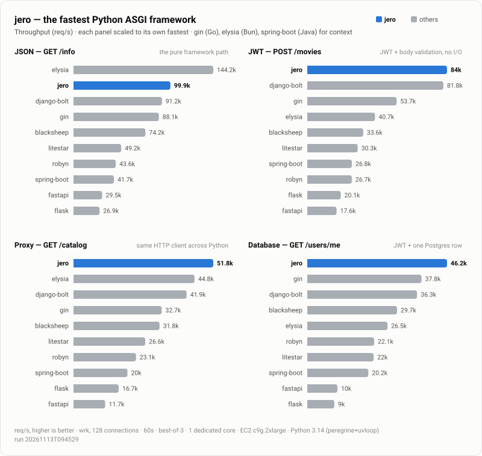

# Performance / Benchmarks

Four workloads, ten frameworks, one worker on one dedicated core each. Every app, the
harness, and the full methodology are public at
[api-benchmarks](https://github.com/RogerThomas/api-benchmarks).

**TL;DR:** jero is the fastest Python framework on all four workloads, by 1.03× to
1.27× over Django Bolt and 1.35× to 4.8× over Blacksheep, Litestar, and FastAPI. Per
core, it beats Go's Gin on all four and is the fastest of all ten on three of them;
only Bun's Elysia is faster, on the pure framework path.

<p align="center">
  
</p>

Each panel is scaled to its own fastest framework; the labels show absolute throughput.

## Setup

| Setting         | Value                                                             |
| :-------------- | :---------------------------------------------------------------- |
| Machine         | Amazon EC2 `c9g.2xlarge` spot, eu-central-1, one framework at a time |
| Machine specs   | AWS Graviton5 (arm64), 8 vCPUs (physical cores, no SMT), 16 GiB   |
| CPU             | 1 dedicated core per framework (cpuset affinity)                  |
| Workers         | 1 (Gin at `GOMAXPROCS=1`, Go's own default on one core; Django Bolt at `--processes 1`) |
| Spring Boot     | Tomcat with virtual threads, JVM defaults (no heap flags)         |
| Load generator  | wrk 4.2.0, 2 threads on 2 dedicated cores                         |
| Concurrency     | 128 connections, closed loop                                      |
| Duration        | 60s per attempt, after an untimed 3s warm-up                      |
| Best-of-N       | 3 attempts, highest throughput kept                               |
| Python          | 3.14.9 (uv's standalone CPython, every Python framework)          |
| Python server   | [peregrine](https://pypi.org/project/peregrine-server/) 1.2.0 + uvloop (Flask via peregrine WSGI; Robyn and Django Bolt ship their own Rust servers) |
| Outbound client | lothc 0.3.0 (native transport) for every Python framework         |
| Database driver | fastpg for the async Python fleet; psycopg for sync Flask         |
| Pools           | 64 connections per framework, database and outbound HTTP alike    |
| Versions        | jero 0.4.0, Django Bolt 0.13.0, FastAPI 0.162.5                   |
| Run             | `20261113T094529`, all ten frameworks, api-benchmarks commit `da79feb` |

- **Correctness first.** Every framework passed a 100-request body check before load
  and returned 100% expected statuses under it.
- **Shared libraries.** Every Python framework uses the same HTTP client (lothc), JWT
  decoder (ryjwt), and Postgres driver (fastpg; Django Bolt included, bypassing Django's
  ORM). jero's author wrote all three, and this benchmark.
- **Native code.** The Python stacks do their JSON, JWT, database, and HTTP-client work
  in C and Rust extensions; Gin uses `encoding/json`, golang-jwt, and pgx.
- **Otherwise idiomatic.** The differences between apps are listed under "Known,
  intended differences" in the [api-benchmarks README](https://github.com/RogerThomas/api-benchmarks#readme).
- **Latency is under full load** (128 connections, closed loop), where tails run
  optimistic.

## Results

`req/s` higher is better; `mean` and `p99` lower is better.

### 1. `GET /info`: the pure framework path

Route, build a typed JSON response with a custom header, encode. No I/O.

| Framework            | req/s      | mean       | p99        | vs jero   |
| :------------------- | :--------- | :--------- | :--------- | :-------- |
| elysia *(Bun)*       | 144.2k     | 0.89ms     | 1.86ms     | 1.44×     |
| **jero**             | **99.9k**  | **1.27ms** | **1.32ms** | **1.00×** |
| django-bolt          | 91.2k      | 1.40ms     | 1.43ms     | 0.91×     |
| gin *(Go)*           | 88.1k      | 1.46ms     | 3.28ms     | 0.88×     |
| blacksheep           | 74.2k      | 1.72ms     | 1.77ms     | 0.74×     |
| litestar             | 49.2k      | 2.59ms     | 2.64ms     | 0.49×     |
| robyn                | 43.6k      | 2.93ms     | 3.04ms     | 0.44×     |
| spring-boot *(Java)* | 41.7k      | 3.06ms     | 4.86ms     | 0.42×     |
| fastapi              | 29.5k      | 4.32ms     | 4.45ms     | 0.30×     |
| flask                | 26.9k      | 4.74ms     | 4.86ms     | 0.27×     |

### 2. `POST /movies`: JWT auth and body validation

JWT auth, decode and validate a five-field body, return it with a new id, `201`. No I/O.

| Framework            | req/s      | mean       | p99        | vs jero   |
| :------------------- | :--------- | :--------- | :--------- | :-------- |
| **jero**             | **84.0k**  | **1.51ms** | **1.57ms** | **1.00×** |
| django-bolt          | 81.8k      | 1.56ms     | 1.59ms     | 0.97×     |
| gin *(Go)*           | 53.7k      | 2.39ms     | 5.07ms     | 0.64×     |
| elysia *(Bun)*       | 40.7k      | 3.14ms     | 6.06ms     | 0.48×     |
| blacksheep           | 33.6k      | 3.78ms     | 3.84ms     | 0.40×     |
| litestar             | 30.3k      | 4.20ms     | 4.27ms     | 0.36×     |
| spring-boot *(Java)* | 26.8k      | 4.77ms     | 7.31ms     | 0.32×     |
| robyn                | 26.7k      | 4.78ms     | 4.86ms     | 0.32×     |
| flask                | 20.1k      | 6.35ms     | 6.49ms     | 0.24×     |
| fastapi              | 17.6k      | 7.26ms     | 7.44ms     | 0.21×     |

### 3. `GET /catalog`: the outbound hop

An authenticated call to a Rust upstream, decoded into a typed model and returned.

| Framework            | req/s      | mean       | p99        | vs jero   |
| :------------------- | :--------- | :--------- | :--------- | :-------- |
| **jero**             | **51.8k**  | **2.46ms** | **2.65ms** | **1.00×** |
| elysia *(Bun)*       | 44.8k      | 2.85ms     | 4.81ms     | 0.87×     |
| django-bolt          | 41.9k      | 3.05ms     | 4.03ms     | 0.81×     |
| gin *(Go)*           | 32.7k      | 3.91ms     | 7.14ms     | 0.63×     |
| blacksheep           | 31.8k      | 4.01ms     | 4.29ms     | 0.62×     |
| litestar             | 26.6k      | 4.82ms     | 7.65ms     | 0.51×     |
| robyn                | 23.1k      | 5.54ms     | 8.41ms     | 0.45×     |
| spring-boot *(Java)* | 20.0k      | 6.40ms     | 9.80ms     | 0.39×     |
| flask                | 16.7k      | 7.64ms     | 7.96ms     | 0.32×     |
| fastapi              | 11.7k      | 11.07ms    | 28.19ms    | 0.23×     |

Elysia relays the upstream JSON without decoding it into a typed model.

### 4. `GET /users/me`: the database read

JWT auth, then one Postgres row by the token's subject. Gin, Elysia, and Spring Boot use
their native drivers.

| Framework            | req/s      | mean       | p99        | vs jero   |
| :------------------- | :--------- | :--------- | :--------- | :-------- |
| **jero**             | **46.2k**  | **2.76ms** | **3.33ms** | **1.00×** |
| gin *(Go)*           | 37.8k      | 3.39ms     | 7.14ms     | 0.82×     |
| django-bolt          | 36.3k      | 3.52ms     | 4.35ms     | 0.79×     |
| blacksheep           | 29.7k      | 4.31ms     | 5.39ms     | 0.64×     |
| elysia *(Bun)*       | 26.5k      | 4.82ms     | 9.34ms     | 0.57×     |
| robyn                | 22.1k      | 5.79ms     | 8.62ms     | 0.48×     |
| litestar             | 22.0k      | 5.83ms     | 8.44ms     | 0.48×     |
| spring-boot *(Java)* | 20.2k      | 6.33ms     | 10.29ms    | 0.44×     |
| fastapi              | 10.0k      | 12.93ms    | 30.44ms    | 0.22×     |
| flask                | 9.0k       | 14.26ms    | 15.79ms    | 0.19×     |

## Caveats

- **Only one core was measured.** Go and the JVM scale across cores inside one
  process; Python and Bun add processes, each with its own memory (~40–83M per Python
  worker here, against Gin's ~10–28M).
- **Spring Boot ran on JVM defaults** at ~615–673M resident; a tuned footprint was not
  measured.
- **A benchmark is not your app.** Fixed payloads on an idle host. Measure the workload
  you care about.

## What middleware and CORS cost

[Middleware](guide/middleware.md) and [CORS](guide/cors.md) compile at wiring, so routes
they don't cover pay nothing. Relative cost on the in-process hot-path harness
(`bench.py`'s POST-echo shape, ~1.3µs/request baseline; in-process numbers exaggerate
deltas compared with a real server):

| configuration | relative cost |
| :-- | :-- |
| no middleware, no CORS | 1.00× |
| wildcard CORS / a constant `response_headers` block | ~1.02× |
| origin allow-list CORS | ~1.15× |
| on-scope `intercept` (falling through) | ~1.4× |
| `observe` | ~1.6× |
| `response_headers` method | ~1.9× |

For contrast, one onion-style ASGI wrapper appending a single constant CORS pair costs
~1.3× on every request.

## Measure it yourself

One script runs jero, Litestar, BlackSheep, and FastAPI **in-process as bare ASGI
callables** (no server, no sockets) against a hand-rolled raw ASGI app doing the same
work, the ceiling for that work. With no server in the loop the gaps run far wider than in
the tables above, so read each framework's distance from `raw`, not its throughput.

```bash
curl -LsSf https://raw.githubusercontent.com/RogerThomas/jero/main/benchmarks/micro_bench.py | uv run -
```

The source is below; save it as `micro_bench.py` and `uv run micro_bench.py` to run it
locally.

```python
--8<-- "benchmarks/micro_bench.py"
```
